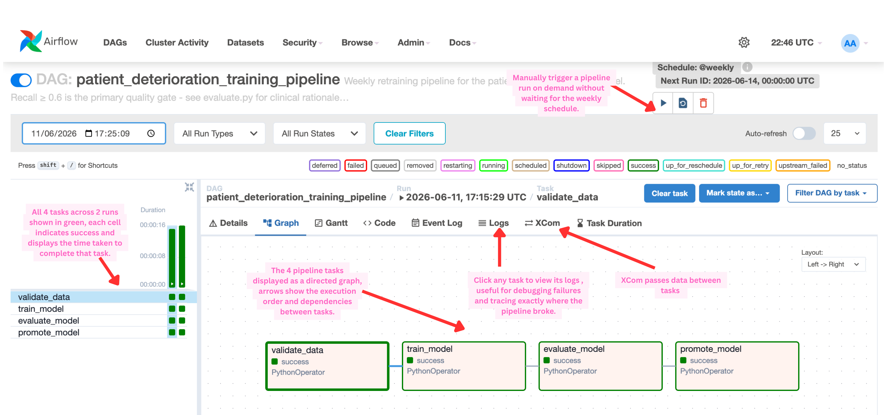
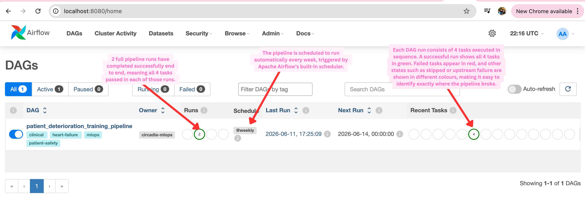
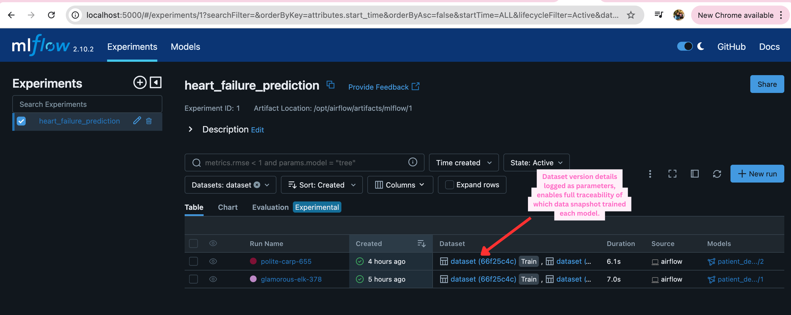
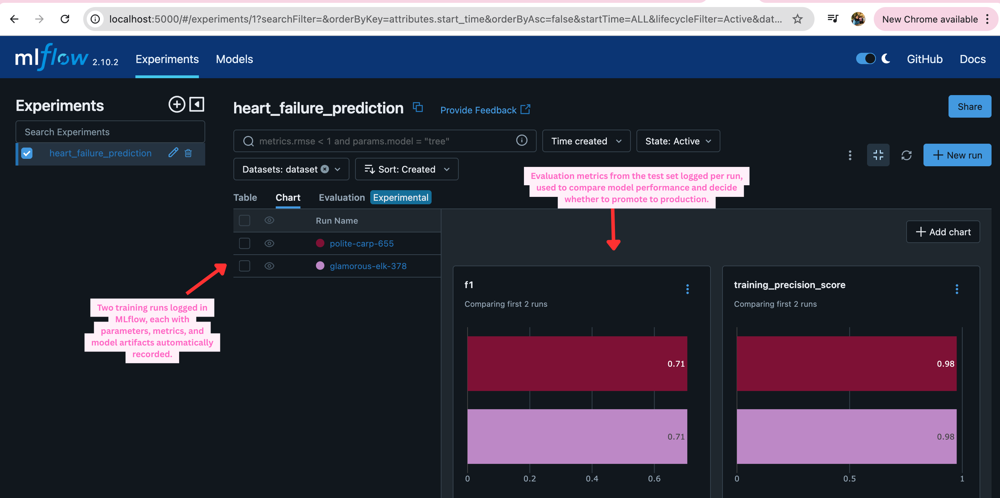
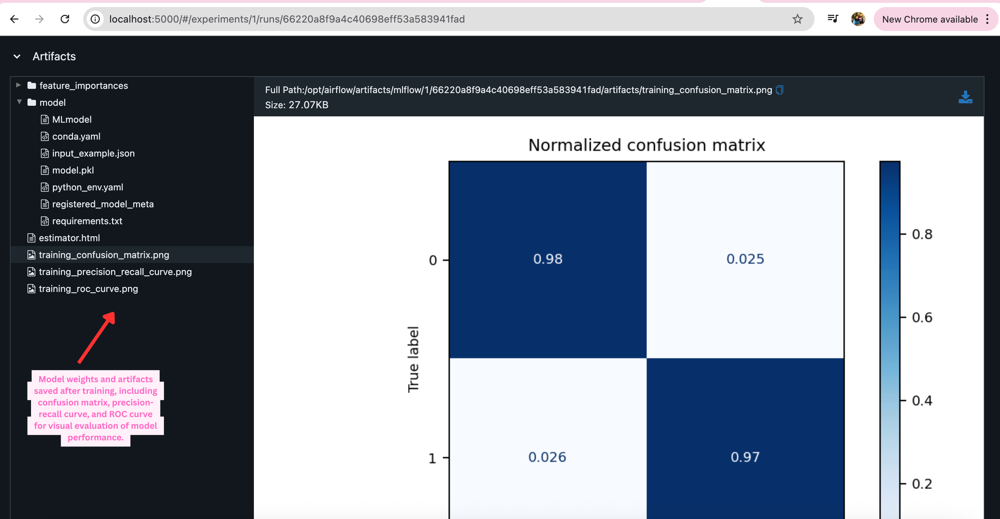
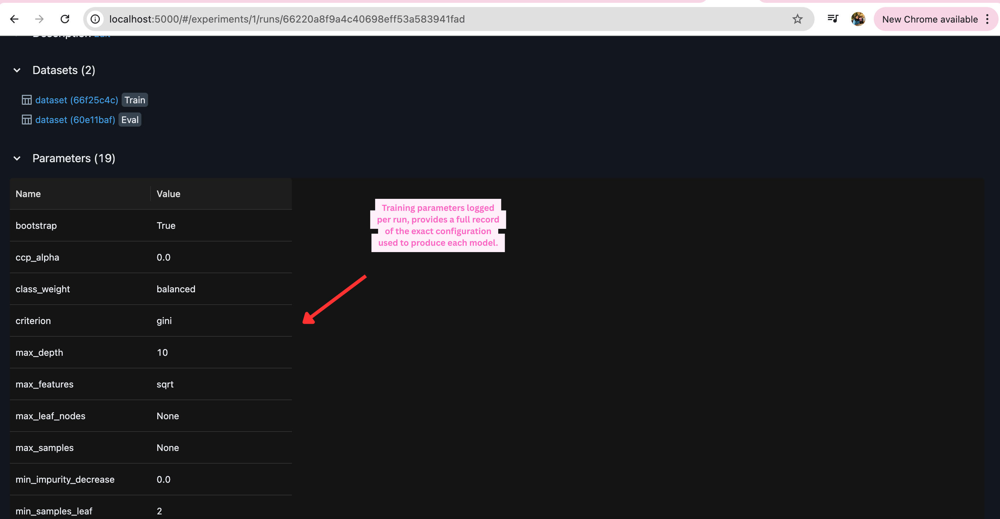
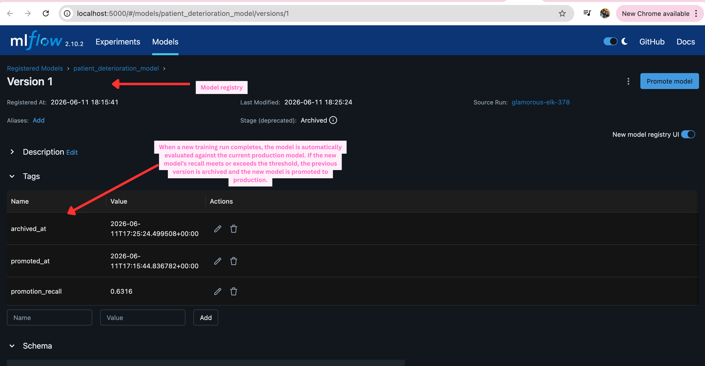
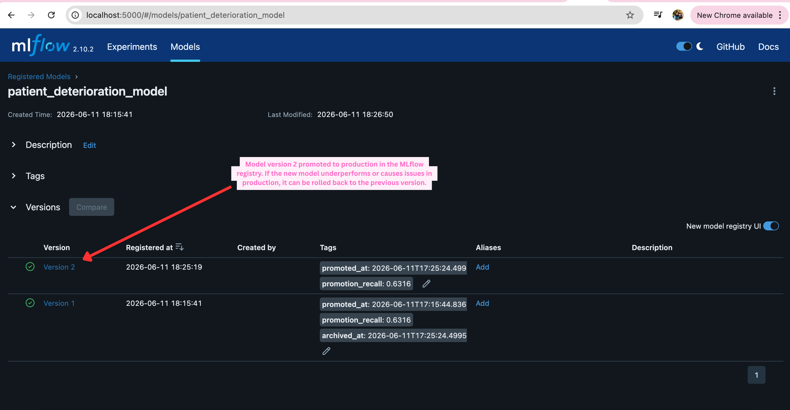

# MLOps Pipeline on Clinical data

End-to-end MLOps pipeline for patient deterioration risk prediction - demonstrating production-grade ML infrastructure patterns for healthcare AI, built on the Heart Failure Clinical Records dataset.

---

## Architecture

```
[Heart Failure Dataset (299 patients)]
         │
         ▼ weekly via Airflow
  ┌─────────────────┐
  │  validate_data  │  schema · range · null rate · volume checks
  └────────┬────────┘
           ▼
  ┌─────────────────┐
  │  train_model    │  RandomForestClassifier · MLflow autolog
  └────────┬────────┘
           ▼
  ┌─────────────────┐
  │ evaluate_model  │  recall ≥ 0.60 gate · ≤ 5% regression vs prod
  └────────┬────────┘
           ▼
  ┌─────────────────┐
  │  promote_model  │  Staging → Production in MLflow registry
  └────────┬────────┘
           ▼
  ┌─────────────────┐
  │   Monitoring    │  dead man's switch · data freshness checks
  └─────────────────┘
```

---

## Stack

| Component | Technology                          |
|-----------|-------------------------------------|
| Orchestration | Apache Airflow 2.11.2               |
| Experiment tracking | MLflow 2.10                         |
| Model | scikit-learn RandomForestClassifier |
| Local runtime | Docker Compose                      |
| Language | Python 3.10                         |

---

## Key design decisions

### Recall-first metrics

This pipeline uses **recall** (sensitivity) as the primary quality gate, not accuracy. The dataset is class-imbalanced (~68% survived, ~32% died). A naive model predicting "no risk" for every patient achieves 68% accuracy but catches zero deteriorating patients.

In a clinical safety context:
- **False negative** (missed deterioration) → patient deteriorates unnoticed, potentially preventable harm
- **False positive** (false alarm) → clinical staff investigate and find nothing, time wasted

The 0.60 recall threshold means at worst 1 in 4 deteriorating patients is missed. We accept more false alarms to ensure we catch true deteriorations.

### Shadow deployment before canary

In a canary deployment, a percentage of real patients receive predictions from an unvalidated model. For a clinical safety system, any live exposure of patients to an unvalidated model is unacceptable.

Shadow deployment runs the candidate model on real data but never exposes its predictions to clinicians. Only after shadow agreement ≥ 90% do we proceed to full promotion.

### Dead man's switch for silent failures

A silent pipeline failure is the worst failure mode: the model becomes stale, clinical staff continue trusting it, and no alert fires. The dead man's switch inverts this - the pipeline must actively signal health every 15 minutes. Absence of the signal IS the alert.

---

## Running locally

**Prerequisites:** Docker and Docker Compose installed.

**1. Clone and download the dataset**

```bash
git clone https://github.com/caraevangeline/mlops-clinical-pipeline
cd mlops-clinical-pipeline

# Download the Heart Failure Clinical Records dataset
# From: https://archive.ics.uci.edu/dataset/519/heart+failure+clinical+records
# Place the CSV at:
mkdir -p data
# data/heart_failure_clinical_records.csv
```

**2. Start all services**

```bash
docker-compose up
```

This starts:
- Airflow webserver at `http://localhost:8080` (user: `airflow`, password: `airflow`)
- MLflow tracking server at `http://localhost:5000`
- Postgres (Airflow metadata database)

Wait ~2 minutes for services to initialise.

**3. Trigger the training pipeline**

Via Airflow UI:
- Navigate to `http://localhost:8080`
- Find the DAG: `patient_deterioration_training_pipeline`
- Click the "Play" button to trigger a manual run




Via CLI:
```bash
docker-compose exec airflow-webserver \
  airflow dags trigger patient_deterioration_training_pipeline
```

**4. View results in MLflow**

Open `http://localhost:5000` to see:
- Training experiments with all metrics logged
- Feature importance artifacts
- Model registry with Staging/Production stages








---

## Project structure

```
mlops-clinical-pipeline/
├── docker-compose.yml          # Full local stack: Airflow + MLflow + Postgres
├── requirements.txt
├── dags/
│   └── training_pipeline.py   # Airflow DAG: validate → train → evaluate → promote
├── src/
│   ├── data/
│   │   ├── ingest.py           # Load dataset + log basic stats
│   │   └── validate.py         # Schema, range, null rate, volume checks
│   ├── features/
│   │   └── engineer.py         # Normalisation + feature matrix construction
│   ├── training/
│   │   └── train.py            # Train RandomForest + MLflow logging + registry
│   ├── evaluation/
│   │   ├── evaluate.py         # Staging vs production recall comparison
│   │   └── drift.py            # KS test drift detection vs training reference
│   ├── deployment/
│   │   ├── promote.py          # Staging → Production promotion
│   │   ├── shadow.py           # Shadow deployment: compare prod vs candidate
│   │   └── rollback.py         # Restore previous production version
│   └── monitoring/
│       └── pipeline_health.py  # Dead man's switch + prediction freshness
```

---

## Dataset

**Heart Failure Clinical Records** - Chicco D, Jurman G. *Machine learning can predict survival of patients with heart failure from serum creatinine and ejection fraction alone.* BMC Medical Informatics and Decision Making, 2020.

- 299 patients, 13 features, binary classification (30-day all-cause mortality)
- Source: [UCI ML Repository](https://archive.ics.uci.edu/dataset/519/heart+failure+clinical+records)
- Fully de-identified - no PHI

This project uses a public dataset to demonstrate MLOps infrastructure patterns that would apply to real patient data in a clinical environment.

---

## TODO
### CI/CD quality gates

Every pull request must pass:
1. Unit tests (data validation + model quality)
2. Data validation on synthetic sample data
3. Model recall ≥ 0.60 on synthetic training run

Every merge to `main`:
1. All unit tests
2. Full training pipeline on production data
3. Clinical quality gate (recall + regression check)
4. Automatic promotion to MLflow Staging
5. **Manual approval required** before Production promotion

The manual approval step ensures a human reviews model metrics in MLflow before any model update reaches clinicians.
